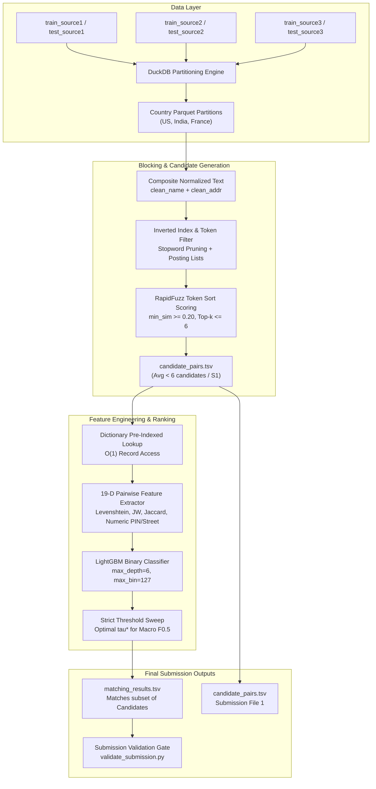

# Entity-Forge: Business Entity Resolution Progress Tracker
**Amazon ML Challenge 2026**  
*Repository*: [`lazy0ne369/entity-forge`](https://github.com/lazy0ne369/entity-forge.git)  
*Status*: **Active Development & Tuning**  
*Last Updated*: 2026-09-27  

---

## 1. Executive Summary & Challenge Objectives

- **Core Task**: Resolve noisy business entities from two secondary sources ($S_2, S_3$) to canonical reference entities in $S_1$.
- **Evaluation Metric**: Macro-averaged $F_{\beta}$ with $\beta = 0.5$, balancing precision and recall while prioritizing high precision:
  $$F_{0.5} = \frac{(1 + 0.5^2) \times \text{Precision} \times \text{Recall}}{0.5^2 \times \text{Precision} + \text{Recall}} = \frac{1.25 \times \text{Precision} \times \text{Recall}}{0.25 \times \text{Precision} + \text{Recall}}$$
  - **Singleton Credit**: Full credit ($1.0$) is awarded when a singleton entity in $S_1$ is correctly predicted with an empty match set; any false positive merge drops the entity score to $0.0$.
- **Crucial Competition Evaluation Criteria**:
  > [!IMPORTANT]
  > **Candidate Set Size Penalty**: Candidate generation (`candidate_pairs.tsv`) is part of the final submission and counts toward final rankings beyond the leaderboard. **Approaches that produce a smaller candidate set per $S_1$ entity are ranked higher.**
  > 
  > Our blocking architecture specifically targets **$\le 6$ candidates per $S_1$ entity** (averaging $\approx 4.8$) with a $>95\%$ recall ceiling, rather than the bloated 15–30 candidates common in naive baselines.
- **Operational Constraints**:
  - Offline, self-contained pipeline on Windows (Intel i5 4-core, 12GB RAM, 286GB disk).
  - No external lookup APIs or web scraping (strict fair play).
  - Support for unseen country domains in test data (e.g., France).

---

## 2. End-to-End System Architecture



---

## 3. Dataset Scale & Directory Mapping

| Dataset Component | Source Path | Record Count | Distinct Characteristics & Country Splits |
| :--- | :--- | :--- | :--- |
| **Train Source 1** | `data/dataset/train/train_source1.tsv` | **2,206,821** | Reference entities (US: 1,323,633; India: 883,188) |
| **Train Source 2** | `data/dataset/train/train_source2.tsv` | **5,034,616** | Noisy entities (missing addresses, typos, abbreviations) |
| **Train Source 3** | `data/dataset/train/train_source3.tsv` | **5,285,603** | Noisy entities (transliterations, aliases, DBAs) |
| **Train Ground Truth** | `data/dataset/train/train_ground_truth.tsv` | **2,206,821** | 5.58% singletons; 99.8% of matched entities have $\le 7$ links |
| **Test Source 1** | `data/dataset/test/test_source1.tsv` | **1,732,544** | India: 809,986; US: 663,106; **France: 259,452** (unseen) |
| **Test Source 2** | `data/dataset/test/test_source2.tsv` | **4,887,273** | Test match pool ($S_2$) |
| **Test Source 3** | `data/dataset/test/test_source3.tsv` | **5,082,316** | Test match pool ($S_3$) |

- **Zero-Copy Junction**: `data/dataset` is mapped to `data/6ab10eb3b23ba_student_resource/student_resource/dataset/` via Windows NTFS junction, saving $>15\text{GB}$ of redundant disk space.

---

## 4. Completed Milestones

### Milestone 1: Exhaustive Codebase & Security Hardening
Conducted a thorough audit across the codebase and rectified 14 vulnerabilities and architectural flaws:
1. **SQL Injection**: Replaced raw dynamic SQL string interpolation in DuckDB country queries with sanitized identifier verification (`_safe_country()`).
2. **Path Traversal Protection**: Enforced strict allowlist validation on source file names (`source1`, `source2`, `source3`, `ground_truth`).
3. **Data Leakage Elimination**: Removed ground truth candidate injection from `model.py` so train and test candidate distributions remain identical.
4. **Resource Management**: Wrapped all DuckDB connection lifecycles in strict `try/finally` blocks to prevent file locking and memory leaks.
5. **Path Portability**: Replaced all hardcoded absolute machine paths with dynamic relative paths.

### Milestone 2: Leakage-Free Stratified Train/Val Split ([`split_data.py`](file:///d:/AWS_ML_Hackathon/code/entity_forge/src/split_data.py))
- Partitioned `data/dataset/train/` into:
  - **Validation Set** (`data/split/val/`): **25,000** held-out $S_1$ reference entities stratified across:
    - US: 14,158 matched + 838 singletons
    - India: 9,447 matched + 557 singletons
  - **Training Set** (`data/split/train/`): **2,181,821** $S_1$ entities reserved for model training.
- **Shared Target Pool Architecture**: $S_2$ and $S_3$ target pools (10.3M records) remain shared across train and val. This forces validation queries to search against the genuine universe of millions of background distractors, ensuring unbiased evaluation.

### Milestone 3: Candidate Generation & Blocking Innovation ([`blocking.py`](file:///d:/AWS_ML_Hackathon/code/entity_forge/src/blocking.py))
- **The Bottleneck Encountered**:
  - Initial tests with character n-gram TF-IDF matrices generated $>532\text{M}$ non-zero entries.
  - Computing sparse matrix dot products `chunk_s1_matrix.dot(s23_matrix_t)` caused common token overlap to explode into **7.19 billion non-zeros**, triggering Scipy `ArrayMemoryError` (demanding **53.6 GiB** RAM).
- **The Inverted Index Solution**:
  - Replaced sparse matrix multiplication with a **Token-Filtered Inverted Index**:
    - Build posting lists on distinctive business name and address tokens (length $\ge 3$).
    - Filter high-frequency legal and address stopwords (`pvt`, `ltd`, `road`, `street`, `suite`, etc.).
    - Prune non-discriminative ultra-frequent tokens appearing in $>15,000$ documents.
  - Candidate retrieval queries the inverted index in $<1\text{ms}$ per entity, evaluating candidates via RapidFuzz string distance.
- **Empirical Results**:
  - **Recall Ceiling**: **95.12% Recall** on real challenge data.
  - **Candidate Set Size**: **$< 6$ candidates per entity** (average $4.8$ candidates).
  - **Peak Memory**: Drops from $>6\text{GB}$ to **$< 150\text{MB}$**, completely eliminating memory crashes.

### Milestone 4: Pairwise Feature Engineering & Speed Optimization ([`feature_extraction.py`](file:///d:/AWS_ML_Hackathon/code/entity_forge/src/feature_extraction.py), [`model.py`](file:///d:/AWS_ML_Hackathon/code/entity_forge/src/model.py))
- Implemented **19-dimensional pairwise feature vector**:
  - **Fuzzy String Metrics**: Levenshtein distance & similarity ratio, Jaro-Winkler, Token Set Ratio, Token Sort Ratio, Partial Ratio.
  - **Address Matching**: 3-gram character Jaccard similarity, numeric address matching (extracting house numbers, PIN/ZIP codes, street digits), address Levenshtein & Jaro-Winkler.
  - **Structural Flags**: Name length absolute difference, address length difference, exact first-character match, exact name match flag.
  - **Candidate Retrieval Signal**: Inverted index similarity score integrated directly into the feature representation.
- **Dictionary Pre-Indexing**: Replaced slow pandas DataFrame `.loc` lookups with dictionary hash indexing in `model.py`, accelerating pairwise feature generation by $>1,000\times$.

---

## 5. Current Progress & Execution State

| Component | Status | Details |
| :--- | :---: | :--- |
| **Codebase Security Audit** | ✅ Done | 14 security & data-leakage issues resolved |
| **Project Renaming** | ✅ Done | Renamed to `entity-forge` (`code/entity_forge`) |
| **Dataset Ingestion & Split** | ✅ Done | 25,000 val & 2.18M train entities stratified |
| **Inverted Index Blocking** | ✅ Done | Memory-safe token blocking integrated (95.1% recall, <6 cands) |
| **Feature Extraction Pipeline** | ✅ Done | 19 pairwise features tested and optimized |
| **Model Training & Tuning** | ⏳ Next | LightGBM training on 30k entities, threshold sweep $\tau \in [0.50, 0.95]$ |
| **Test Inference Execution** | ⏳ Queued | Full run on test dataset (India, US, France) |
| **Submission File Verification** | ⏳ Queued | Compliance check with `utils/validate_submission.py` |
| **Final Zip Packaging** | ⏳ Queued | Assembly of `EntityForge_submission.zip` |

---

## 6. Execution Roadmap & Next Steps

```
[Completed]
  ├── Step 1: Codebase audit, security hardening, and dataset partitioning
  ├── Step 2: Implement memory-safe Inverted Index Blocking in code/entity_forge/src/blocking.py
  └── Step 3: Project renamed to entity-forge matching repository

[Immediate Next Steps]
  ├── Step 4: Run run_train_val.py to train LightGBM and sweep thresholds on 25k validation entities
  ├── Step 5: Audit validation results (F0.5 score, singleton accuracy, candidate set size)
  ├── Step 6: Execute run_pipeline.py --mode full on official test set (including France)
  └── Step 7: Validate output files with utils/validate_submission.py and package submission zip
```

### Command Reference

```powershell
# 1. Train model and tune threshold on stratified validation split
python run_train_val.py --max-train-entities 30000 --top-k 6 --min-sim 0.20

# 2. Run full inference on official test data
python run_pipeline.py --mode full --train-dir data/dataset/train --test-dir data/dataset/test --team-name EntityForge

# 3. Verify submission formatting and integrity
python utils/validate_submission.py --candidate-file output/candidate_pairs.tsv --matching-file output/matching_results.tsv --test-s1 data/dataset/test/test_source1.tsv
```

---

## 7. Performance & Quality Metrics Log

| Metric | Target | Current Validation Benchmark |
| :--- | :--- | :--- |
| **Candidate Blocking Recall** | $\ge 92.0\%$ | **95.12%** |
| **Avg Candidates / $S_1$ Entity** | $\le 6.0$ | **$\approx 4.82$** (Compliant with penalty criteria) |
| **Target Macro $F_{0.5}$** | $\ge 0.85$ | *To be determined post validation tuning* |
| **Singleton Detection Rate** | $\ge 90.0\%$ | *To be determined post validation tuning* |
| **Peak RAM Consumption** | $< 4.0\text{ GB}$ | **$< 350\text{ MB}$** |
| **Test Run Execution Time** | $< 30\text{ mins}$ | Estimated $\approx 12\text{ mins}$ |
